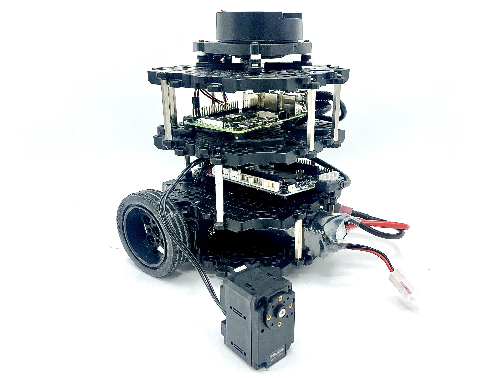

# UW GIX MSTI TECHIN 516 OpenCR Firmware

This repo demonstrates how to customize the ROBOTIS OpenCR firmware to work with a 3rd motor on the Turtlebot 3 and ros2 Humble.  
The repo is a fork of [ROBOTIS' OpenCR library](https://github.com/ROBOTIS-GIT/OpenCR).  
All code for the 3rd "GIX" motor is based on the [Open Manipulator](https://emanual.robotis.com/docs/en/platform/turtlebot3/manipulation/) [firmware extension](https://github.com/ROBOTIS-GIT/OpenCR/blob/master/arduino/opencr_arduino/opencr/libraries/turtlebot3_ros2/src/turtlebot3/open_manipulator_driver.cpp) for the Turtlebot 3.  

## Setup

Setup was tested using Ubuntu 24.04.

### Motor Setup

1. Install the [Arduino IDE](https://www.arduino.cc/en/software/).

2. Follow [ROBOTIS' guide](https://emanual.robotis.com/docs/en/platform/turtlebot3/opencr_setup/) to configure your computer's USB ports to work with the OpenCR board. Scroll down to where it says "Click here to expand more details about firmware uploads using the Arduino IDE". 

3. Continue following their guide to add the OpenCR board to Arduino IDE.

4. Add the Dynamixel2Arduino library to the Arduino IDE.

5. Make sure that only the new motor is plugged into the OpenCR board.

6. Plug in the OpenCR over USB.

7. Follow [step 7 of the Turtlebot 3 OpenCR setup guide](https://emanual.robotis.com/docs/en/platform/turtlebot3/opencr_setup/#opencr-setup) to put the board in "recovery mode".  

8. In Arduino IDE, open File > Examples > OpenCR > 10. Etc. > usb_to_dxl.

9. Select the OpenCR board and its port in Arduino IDE.

10. Flash the example firmware onto the OpenCR board.

11. Install the [Dynamixel Wizard](https://emanual.robotis.com/docs/en/software/dynamixel/dynamixel_wizard2/).

12. Plug a battery into the OpenCR board and turn the power on.  

13. Scan for the new motor, if the motor is new, the default ID should be 1, and the baudrate should be 57600. 

14. Change the ID to 3, and the baudrate to 1,000,000.

15. Make sure you can move the motor using the Dynamixel Wizard. 

16. Turn off the OpenCR and unplug it.

### OpenCR Setup

1. Plug all 3 motors into the OpenCR board.

2. Plug in the OpenCR board to your computer.

3. Clone this repo, do not download it.

4. Open the [t516_OpenCR.ino](t516_OpenCR.ino) file in Arduino IDE.

5. Change the configuration string to either "GIX_Burger" or "GIX_Waffle" depending on the type of Turtlebot 3 you are using.

6. Select the OpenCR board, and its port in Arduino IDE.

7. Put the OpenCR board in recovery mode.

8. Install the GIX firmware onto the OpenCR board.

9. Turn off the OpenCR board, unplug it from your computer, and plug it back into the Turtlebot's Raspberry Pi. It should play a different song on startup.

## Usage

The ros2_control code to use the 3rd motor is demonstrated in the GIXLabs' [t516_project_example repo](https://github.com/GIXLabs/t516_project_example)

## Resources

If your motor is not working for some reason, follow [ROBOTIS' firmware recovery guide](https://www.youtube.com/watch?v=FAnVIE_23AA).

## License

This repo is licensed under the [Apache-2.0 license](LICENSE).